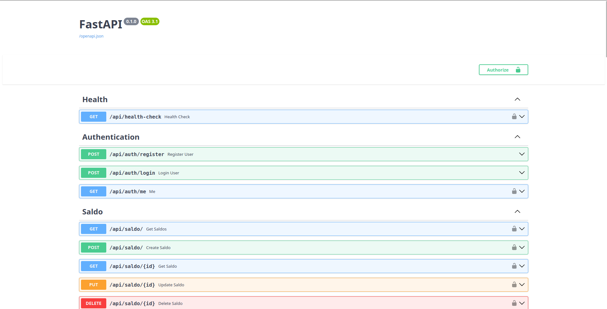

# 💳 Payment Gateway Clean (FastAPI + SQLAlchemy + Async)

A minimal and clean backend project for a payment gateway, built with **FastAPI**, **Async SQLAlchemy**, and **PostgreSQL**.

## 📦 Features

- Auth-ready (bcrypt + JWT)
- Models: User, Saldo, Topup, Transfer, Withdraw
- Clean and modular code structure
- Async database operations
- Alembic support for migrations

## Images

> [!WARNING]
> Important Notice: This Payment Gateway Clean is currently under active development and is not production-ready. Some core features may be incomplete or subject to change. This project is intended for personal use and learning purposes only.
